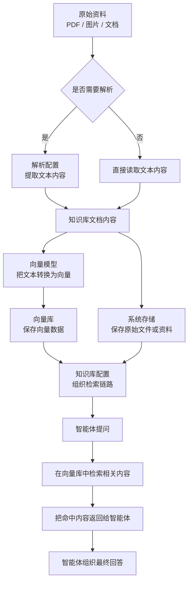

# 知识库概览

知识库的作用很简单：

> 让智能体回答问题时，不只是靠模型自己的常识，而是能参考你自己的资料。

如果你有这些内容，通常就适合做知识库：

- 公司资料
- 产品手册
- FAQ
- 制度文档
- 培训资料
- 操作说明

## 搭一套知识库，通常要配什么

从用户视角看，通常要准备 4 样东西：

1. `向量模型`
   负责把文档变成可检索的数据
2. `向量库`
   负责保存这些可检索的数据
3. `解析配置`
   负责把图片、PDF 等资料里的文字提取出来
4. `知识库配置`
   把上面这些能力真正串起来

## 知识库流程关系图

## 你可以直接这样理解这条链路

- 文件解析：负责把图片、PDF 等资料变成可读文本
- 向量模型：负责把文本转换成可检索数据
- 向量库：负责保存这些可检索数据
- 系统存储：负责保存原始文档或文件本身
- 知识库配置：负责把这些能力真正串起来

## 向量模型到底是什么

很多人第一次做知识库时，最容易不理解的就是“为什么还要单独配一个向量模型”。

你可以直接这样理解：

- 对话模型：负责和用户对话、组织回答
- 向量模型：负责把文档变成“可检索的数据”

也就是说：

- 没有向量模型，文档就很难进入知识库检索链路
- 只有对话模型，不足以把资料做成可搜索的知识库

## 向量模型什么时候需要配

只要你要做知识库，通常就需要配一个向量模型。

最常见场景包括：

- 产品资料问答
- FAQ 问答
- 企业文档查询
- 内部制度检索

## 向量模型和向量库的区别

这两个名字很像，但作用完全不同：

### 向量模型

负责把文档内容转换成向量。

### 向量库

负责保存这些向量，并在查询时找出最相关的内容。

简单说就是：

- 向量模型负责“转换”
- 向量库负责“保存和查找”

## 推荐的配置顺序

第一次配置时，建议按这个顺序：

1. 先配置向量模型
2. 再配置向量库
3. 再配置解析配置
4. 最后创建知识库配置
5. 然后导入少量文档测试

## 第一次测试要怎么做

不要一开始就导很多资料。

建议：

- 先放 1 份 PDF
- 再放 1 份说明文档
- 再放 1 份 FAQ

这样更容易判断是：

- 文档没解析好
- 没入库成功
- 还是检索效果不好

## 推荐阅读

- [向量库配置](/usage/vector-config)
- [解析配置](/usage/parse-config)
- [知识库配置](/usage/rag)
